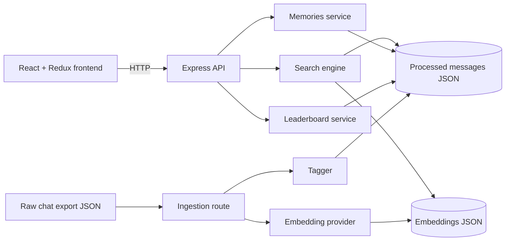
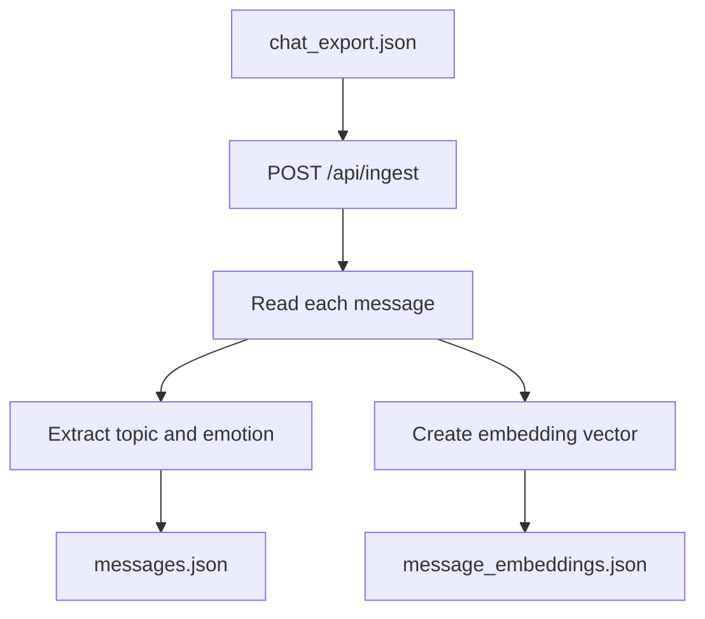
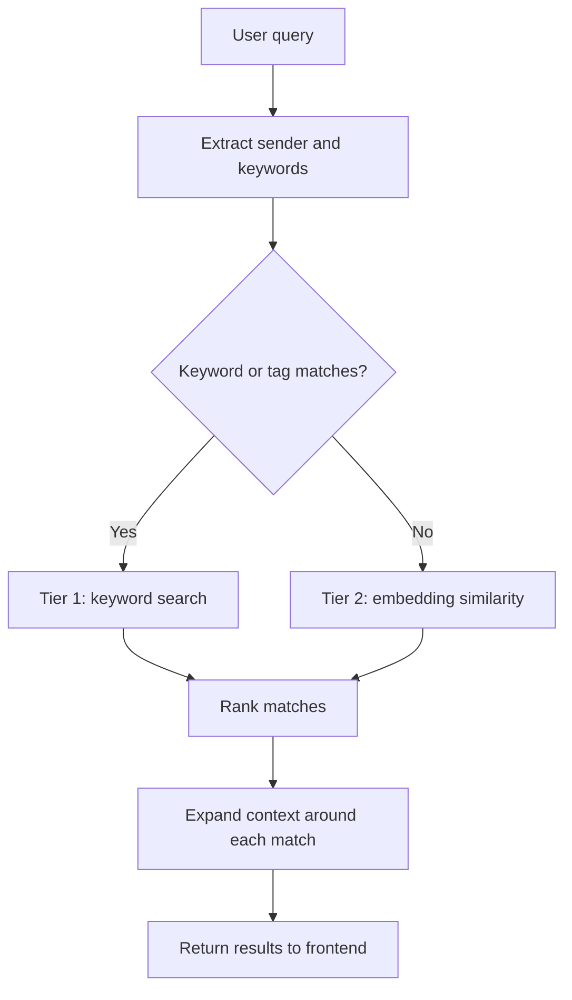

# searchChat

SearchChat is a local-first group chat search dashboard. It helps people find decisions, plans, emotional moments, and recurring topics across a conversation history.

The project includes a React frontend, an Express API, and a small JSON-based search index. The included chat export is demo data so the project can run after a fresh clone.

## What It Does

- Searches message text, topics, emotions, and sender names.
- Falls back to semantic similarity when keyword search is not enough.
- Returns the matching message with surrounding conversation context.
- Shows memories, active topics, and member contributions.
- Re-indexes a raw chat export through the UI or API.

## Architecture



### Main components

| Component | Responsibility |
| --- | --- |
| `frontend/` | React dashboard, search controls, results, memories, and leaderboard views |
| `backend/src/server.js` | Starts Express and registers the API routes |
| `backend/src/routes/` | HTTP endpoints for search, ingestion, status, memories, and leaderboard data |
| `backend/src/services/searchEngine.js` | Keyword matching, semantic fallback, ranking, and context expansion |
| `backend/src/services/tagger.js` | Assigns emotion and topic labels to each message |
| `backend/src/services/embeddings.js` | Creates local or external embedding vectors |
| `backend/src/services/memoriesService.js` | Builds date-based memories and highlights |
| `backend/src/services/leaderboardService.js` | Aggregates topic and member activity |
| `backend/data/` | Raw export, processed messages, and persisted embedding vectors |

## Search Pipeline

### 1. Ingestion and indexing



The ingestion route reads the raw export, tags each message, creates an embedding, and writes two local index files. The default tagger is deterministic and does not require an API key.

### 2. Query and retrieval



Tier 1 checks message text, topic labels, emotion labels, and sender filters. Tier 2 compares the query embedding with stored message vectors using cosine similarity. Each result includes a context window around the matched message.

## Data Model

The repository contains a small demo dataset:

- `backend/data/raw/chat_export.json`: raw source messages.
- `backend/data/processed/messages.json`: normalized messages with `sender`, `text`, `timestamp`, `topic`, and `emotion`.
- `backend/data/embeddings/message_embeddings.json`: persisted vectors used by semantic search.

These files are mocked/demo data. The application flow is real and can be pointed at another export with the same message shape.

## Run Locally

### Requirements

- Node.js 18 or newer
- npm 9 or newer

### Install

From the repository root:

```bash
npm run install:all
```

### Start the application

Use two terminals from the repository root:

```bash
# Terminal 1
npm run dev:backend
```

```bash
# Terminal 2
npm run dev:frontend
```

Open `http://localhost:5173`. The API runs at `http://localhost:5000`.

The Vite server may choose another port if `5173` is already in use. Use the URL printed in the terminal.

## Verify the Project

Build the frontend:

```bash
cd frontend
npm run build
```

Run the backend demo checks:

```bash
npm run demo
```

The demo exercises representative keyword, person/emotion, and semantic searches against the included dataset.

## API Overview

| Method | Endpoint | Purpose |
| --- | --- | --- |
| `POST` | `/api/search` | Search messages with `{ "query": "..." }` |
| `POST` | `/api/ingest` | Rebuild processed messages and embeddings |
| `GET` | `/api/status` | Return index state, counts, senders, and topics |
| `GET` | `/api/messages` | Return all processed messages |
| `GET` | `/api/memories` | Return highlights, optionally filtered by date |
| `GET` | `/api/leaderboard` | Return topic and member activity aggregates |

## Configuration

Create `backend/.env` only when you need custom settings:

```env
PORT=5000
EMBEDDING_PROVIDER=local-semantic
```

The default local provider works without external services. The tagger can optionally use Anthropic when `ANTHROPIC_API_KEY` is configured; otherwise it uses the built-in rule-based fallback.

## Project Structure

```text
searchChat/
├── backend/
│   ├── data/
│   ├── src/
│   │   ├── routes/
│   │   ├── services/
│   │   ├── utils/
│   │   └── server.js
│   └── test-demo.js
├── frontend/
│   └── src/
│       ├── features/
│       │   ├── search/
│       │   ├── memories/
│       │   └── leaderboard/
│       └── store.js
├── package.json
└── README.md
```
